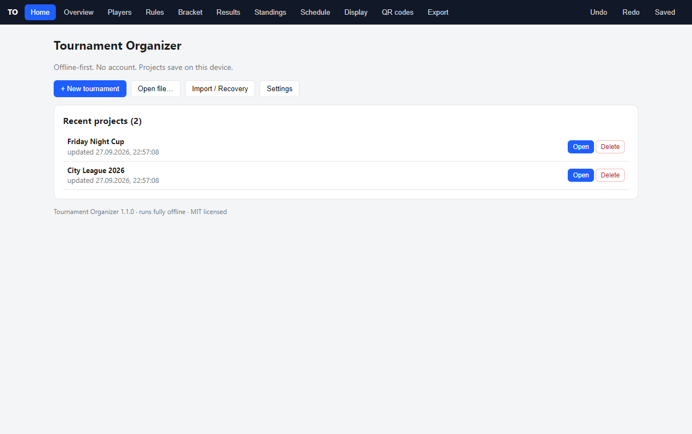
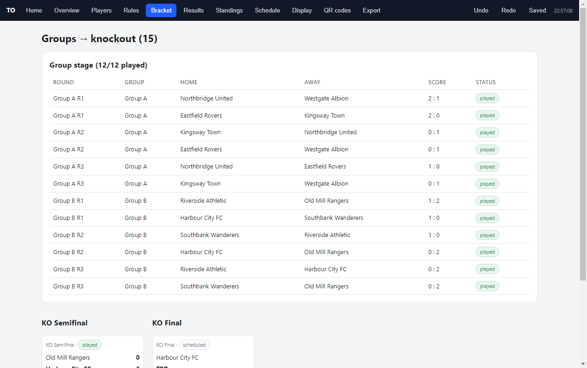
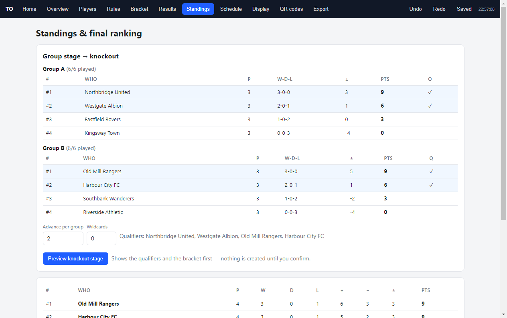
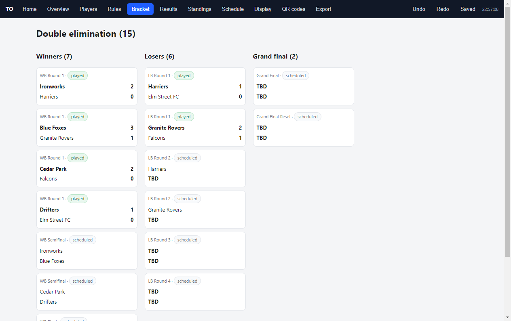

# Tournament Organizer

**Run your tournament on your own computer.** A free desktop app for the people who organise
cups, leagues and club nights: create the bracket, enter results as they happen, print final
standings — **offline, without an account, on your own machine.**

[](https://github.com/OWNER/REPO/actions/workflows/ci.yml)
[](https://github.com/OWNER/REPO/releases/latest)
[](LICENSE)

**[⬇ Download the latest release](https://github.com/OWNER/REPO/releases/latest)** ·
Windows · macOS · Linux · MIT licensed

## What it does

- **Nine competition formats** — single elimination, double elimination (winners + losers
  bracket, grand final, conditional reset), round robin, Swiss, groups + knockout, league
  season, team and individual match events, custom schedule.
- **Brackets that stay correct** — change a result and the bracket recomputes: winners advance,
  results that became impossible are cleared instead of silently kept.
- **Result entry made for a venue** — two score fields and a button, plus walkover, unfinished
  and interrupted states, and keyboard navigation (`j`/`k`, `/`, `Enter`).
- **Standings with your rules** — points, tiebreak order, group tables, and qualifier selection
  that seeds the knockout stage.
- **Offline and local-first** — no account, no server, no telemetry. Autosave to the device,
  export one portable `.top.json` file you own.
- **Recovery built in** — undo/redo, validated import, CSV export and a print sheet.

## Screens

Real screens from the app, generated from a demo tournament — see all nine in the
[launch page](site/index.html).

| | |
|---|---|
|  |  |
| Home — recent projects on this device | Groups + knockout: group results and the seeded KO bracket |
|  |  |
| Standings with tiebreaks and qualifiers | Double elimination: winners, losers and grand final |

## Getting started

1. **Create** a tournament — name, sport and format.
2. **Add participants** — one by one, or paste a whole list.
3. **Set rules and generate** — the schedule appears instantly.
4. **Enter results** — brackets and standings update by themselves.
5. **Export or print** — `.top.json` backup, CSV, or a print sheet.

Full walkthrough: **[docs/USER_GUIDE.md](docs/USER_GUIDE.md)**.

## Downloads

| Your system | File | Install |
|---|---|---|
| Windows (x64) | `Tournament-Organizer-<version>-win-x64.exe` | Run the installer, follow the prompts |
| macOS (Intel & Apple silicon) | `Tournament-Organizer-<version>-mac-<arch>.dmg` | Open the disk image, drag to Applications |
| Linux (x64) | `Tournament-Organizer-<version>-linux-x86_64.AppImage` | `chmod +x`, then run it |

> **The installers are not code-signed.** Windows shows “Unknown publisher” — choose
> *More info → Run anyway*. macOS needs right-click → *Open* the first time. This is expected
> for a free, unsigned release and does not affect how the app works.

## Offline by design

Tournament data lives in the app's local storage on the computer where you created it. There is
no account, no sync and no analytics — nothing leaves your machine unless you export it
yourself. See [PRIVACY.md](PRIVACY.md).

## Event operations (new in 1.1)

- **Display** — a big read-only screen for a projector or TV: current match, what is
  next, the top five and a live clock. Open it in a second window or full screen; it
  updates by itself and holds no organizer controls.
- **Schedule** — define your courts, tables or stations and put matches on them with a
  start time and a duration. Conflicts are listed, and *Fill free slots* plans a day
  without double-booking anything.
- **QR codes** — print check-in codes per participant, a code per match and per station.
  Scanning one opens the app on that exact participant or match. Codes are generated
  locally; nothing is uploaded.
- **Settings → Event operations** — share the project on the local network so a second
  or third device (referee, display, laptop) can receive or send it. No account, no
  internet; merges are per match, newest edit wins, and every merge is undoable.
- **Standings** — *Preview knockout stage* shows who advances, in what order, and the
  bracket that will be created. Nothing is created until you confirm.

Full walkthrough: [docs/USER_GUIDE.md](docs/USER_GUIDE.md).

## Support

- **Bug or idea:** open an issue in the repository (templates included).
- **Releases and downloads:** the repository's *Releases* page.
- **Which version am I running?** Settings → About.
- **Guides:** [user guide](docs/USER_GUIDE.md) · [release process](docs/RELEASE.md) ·
  [release notes](docs/releases/) · [changelog](CHANGELOG.md).

---

## For developers

### Requirements

Node.js 20+ (CI uses 22). Nothing else — the app is fully offline and has no
runtime dependencies.

### Run (development)

```powershell
cd "$env:USERPROFILE\Desktop\tournament-organizer"
npm.cmd ci         # reproducible install from package-lock.json
npm.cmd run dev    # http://localhost:5173
npm.cmd test       # engine + feature-boundary tests
```

Run the desktop shell against a dev server (two terminals):

```powershell
# terminal 1
npm.cmd run dev
# terminal 2 (auto-detects the dev server when no build exists)
npm.cmd run electron
```

Run the packaged-like build locally:

```powershell
npm.cmd run start    # build + electron
```

Shortcuts: `Ctrl+Z` undo · `Ctrl+Y` redo · `Ctrl+S` save · in Results: `j/k` move, `Enter` in score = save played, `/` search.

### Build & package a release

```powershell
npm.cmd run dist       # version:check + tests + build + electron-builder → release\
npm.cmd run dist:win   # Windows installer only
```

Artifacts land in `release/` with the naming convention
`Tournament-Organizer-<version>-<os>-<arch>.<ext>` (e.g. `Tournament-Organizer-1.0.0-win-x64.exe` NSIS installer).
See [docs/RELEASE.md](docs/RELEASE.md) for the full version-bump → publish checklist.

- Version comes from `package.json` and is displayed in the app (Settings → About, Home footer).
  `npm run version:check` fails if package.json, CHANGELOG.md, the app build and artifact
  names ever disagree.
- `build/make-icon.ps1` regenerates `build/icon.png` + `build/icon.ico` deterministically
  (the generated icons themselves are committed — CI needs them on Linux/macOS runners).
- Builds are reproducible from a clean checkout: `npm.cmd ci && npm.cmd run dist`.

### Repository & CI

- **CI** (`.github/workflows/ci.yml`): every push and pull request runs
  `npm run release:check` on Ubuntu and builds the Windows installer as an artifact.
- **Releases** (`.github/workflows/release.yml`): pushing a `v*` tag whose version matches
  `package.json` builds Windows/macOS/Linux artifacts and attaches them to the GitHub Release
  automatically. First-time setup: [docs/RELEASE.md § 0](docs/RELEASE.md).
- **One version source of truth**: `package.json` → injected into the UI at build time,
  embedded in release file names, mirrored by the CHANGELOG entry.
- Tracked: `src/`, `tests/`, `electron/`, `build/`, `docs/`, CI and config files.
  Ignored: `node_modules/`, `dist/`, `release/`, `logs/` (see `.gitignore`).

### Launch assets

- `site/` — the static launch page (GitHub Pages via `.github/workflows/pages.yml`, or any
  static host). It links to `OWNER/REPO` placeholders; replace them after the first push.
- `site/assets/screens/*.png` — screenshots captured from the real app by
  `npm run screenshots`: it builds the app, generates a demo tournament with the actual engine
  (`scripts/demo-fixture.ts`) and photographs real screens (`scripts/screenshots.cjs`).
  Re-run it whenever the UI changes; it never uses mockups.
- Public release notes live in `docs/releases/`, based on `docs/RELEASE_NOTES_TEMPLATE.md`.

### Engine rules (deterministic, UI-independent)

- Bracket slots carry provenance (`match.bracket.srcHome/srcAway`: winner-of / loser-of / seed).
  Every result edit runs full `recomputeBracket()`: derived slots re-resolve, stale
  downstream results are voided (never preserved), bye auto-advance only for
  generation-time manual byes.
- All result writes go through `recordResult()` (`src/engine/result.ts`): validates
  scores, rejects knockout draws explicitly, stamps occupant tag, recomputes.
- `computeStandings()` is pure (no input mutation): walkovers = points only (no
  free goals), unfinished/interrupted ignored, tiebreak order from rules + id fallback.
- Withdrawal ejects from unplayed matches (walkover, tagged `[withdrawal]`), keeps history.
- Double elim: WB + LB (fresh losers paired, then survivors vs new losers, WB-final
  loser awaits in last LB round) + Grand Final + Conditional Reset (only if L-side wins GF1).
- Import validates deeply (ids, dup ids, match shape, version 0–1), drops dangling
  matches with a warning, recomputes brackets on load; v0 migrates with warning.

### Data

- `localStorage` autosave (~800ms, failures surface as a banner — never silent);
  `.top.json` portable backup; standings/matches CSV; print stylesheet.
- Free/Pro feature boundary lives in `src/engine/features.ts` — all core features
  are declared `free`; future Pro features are registered but not wired to any UI,
  so entitlement logic can be added later without touching the engine or offline use.

### Project layout

```
electron/     main.cjs (window state, file dialogs, single instance) + preload.cjs
src/engine/   pure domain logic (no UI, no I/O) — fully tested
src/state/    React store (history, autosave, settings)
src/ui/       screens
scripts/      version check, demo fixture, screenshot capture
site/         static launch page + screenshots (GitHub Pages)
tests/        vitest suites
docs/         user guide, release process, public release notes
build/        icon assets + icon generator
```
